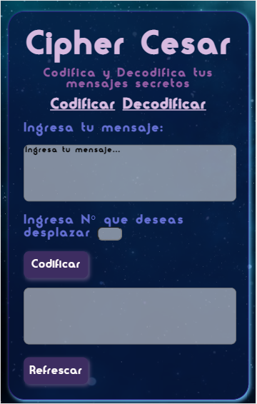
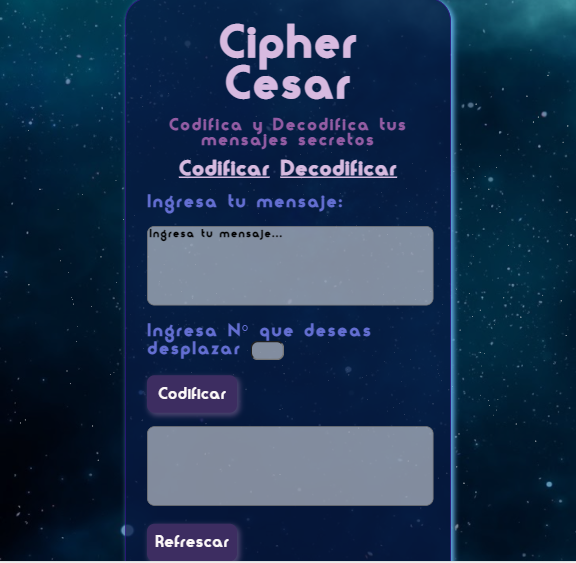

# Cifrado César

Se creó una Appweb la cual tiene como funcionalidad cifrar y descifrar un mensaje 

## Desarrollado para 
Cualquier persona que desee cifrar y desifrar mensajes con una temática espacial. Con ésta Appweb logrará comunicarse con amigos, familia, pareja, compañeros de trabajo,etc mediante mensajes secretos. 
 
 # Vistas 
 ## versión mobile 

 ## versión desktop 
 [Desktop](VistaEscritorio.png)

 ## versión Tablet
 

# Instrucciones de uso 
* Elegir texto a cifrar
* Colocar el texto en el primer cuadro de texto 
* Elegir el desplazamiento 
* Presionar el botón "Cifrar"
* El mensaje cifrado aparecerá en el segundo cuadro de texto 
* Copiar el mensaje cifrado 
* Refrascar la página con el último botón de "Refrescar"
* Presionar el link "Desifrar"
* Pegar el mensaje cifrado en el primer cuadro 
* Colocar el mismo desplazamiento que se utilizó para cifrar
* Presionar el botón "Desifrar" 
* En el segundo cuadro aparecerá el mensaje desifrado 

# Enlace Appweb

