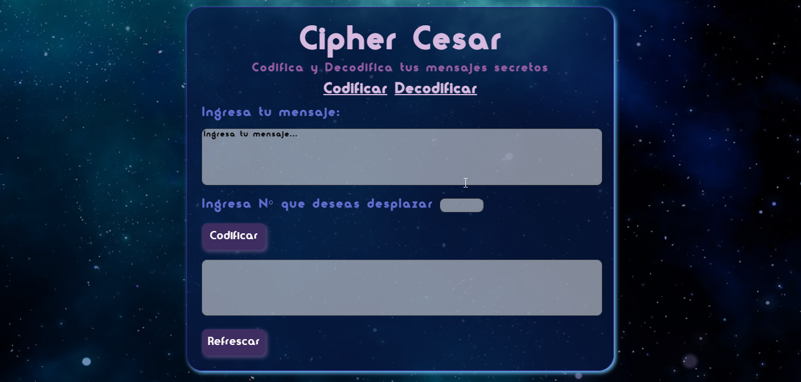

# Cifrado César

Cifrado César es una Appweb la cual tiene como funcionalidad cifrar y descifrar un texto a elección por el usuario

## Desarrollado para 
Cualquier persona que desee cifrar y desifrar mensajes con una temática espacial. Con ésta Appweb logrará comunicarse con amigos, familia, pareja, compañeros de trabajo,etc. Mediante mensajes secretos. 
 
 # Vistas 
 ## versión mobile 

 ## versión desktop 
 

 ## versión Tablet
 

# Instrucciones de uso 
* Elegir texto a cifrar
* Colocar el texto en el primer cuadro de texto 
* Elegir el desplazamiento 
* Presionar el botón "Codificar"
* El mensaje codificado aparecerá en el segundo cuadro de texto 
* Cortar o copiar el mensaje codificado/cifrado
* Refrascar la página con el último botón de "Refrescar"
* Presionar el link "Decodificar"
* Pegar el mensaje codificado en el primer cuadro 
* Colocar el mismo desplazamiento que se utilizó para codificar
* Presionar el botón "Decodificar" 
* En el segundo cuadro aparecerá el mensaje desifrado/decodificado

# Enlace Appweb

